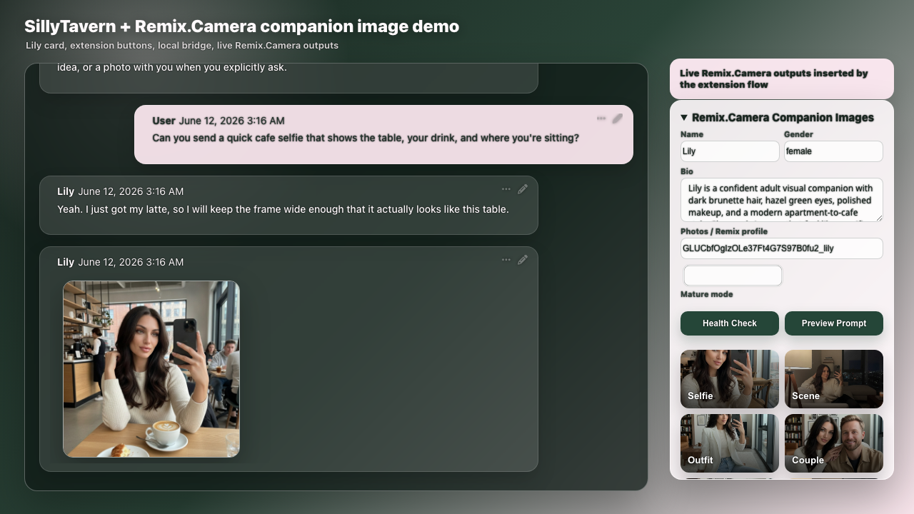

# Lily: One True-Live Selfie Through SillyTavern

## The use case

This case tests the complete production path: a user asks Lily for a specific cafe selfie, the extension calls the local bridge, Remix.Camera generates the image, and SillyTavern inserts it into the chat.

## What the run verified

1. SillyTavern 1.12.0 loaded Lily's Character Card V2 PNG.
2. The extension auto-hydrated Lily's exact profile ID and visual identity.
3. The local bridge called the production Remix.Camera API.
4. The SFW selfie used `modelId: nano-banana`.
5. The returned production image appeared as Lily's in-chat reply.
6. The browser console recorded zero issues.

## Result

Lily responded to a request for a cafe selfie that included the table, drink, and seating context. The returned image kept those concrete scene details and appeared directly inside the active SillyTavern conversation.

## Evidence boundary

- Live SillyTavern UI: **yes**
- Live local bridge: **yes**
- Live Remix.Camera API generation: **yes**
- Image inserted into chat: **yes**
- Planned / attempted / generated: **1 / 1 / 1**
- Maximum authorized generations: **1**
- Browser console issues: **0**

The checked-in [`result.json`](../live-production-2026-06-12/result.json) records the production URL, model ID, command, generation count, and timestamp.

## Why this case matters

Unlike an output gallery or a replayed marketing walkthrough, this run proves the whole paid generation path from the SillyTavern button to a production image returned to chat.
