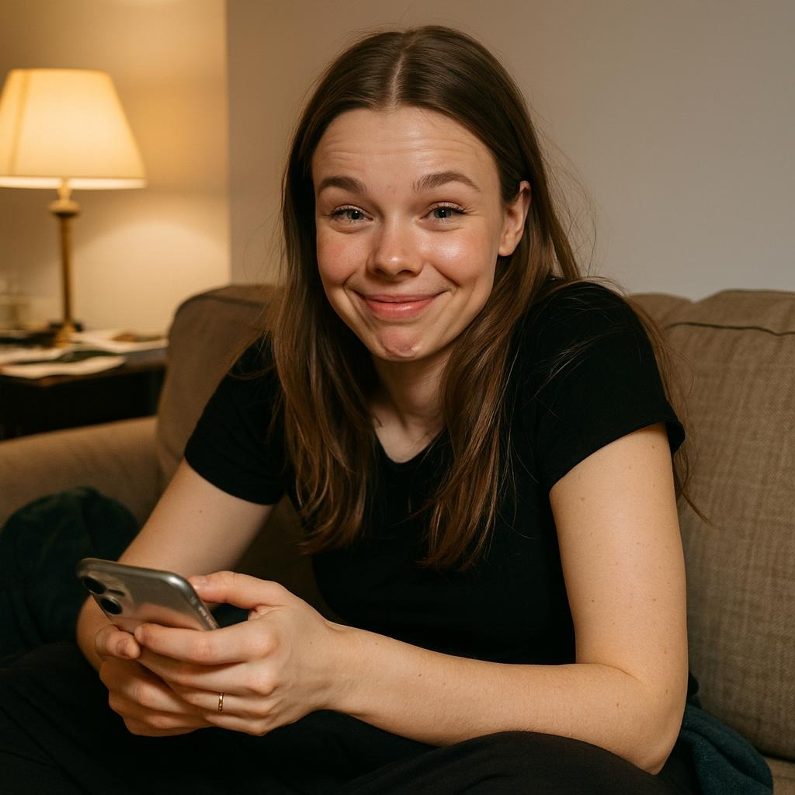

# Mila: Recent Chat Context to a Casual Couch Selfie

## The use case

A companion image feels more natural when it continues the conversation instead of behaving like a separate prompt box. Mila's `auto-selfie-from-chat` path turns recent chat context into a reviewable scene request while keeping the character profile attached.

## What the workflow does

1. Reads the recent chat text supplied by SillyTavern.
2. Selects the `auto-selfie-from-chat` command and searches Remix.Camera prompt templates for a relevant scene.
3. Builds a prompt around Mila's paired profile and the current conversational details.
4. Exposes the selected template and final prompt in Preview Prompt before any credit is spent.
5. Inserts the returned image into the active chat after an explicitly confirmed generation.

## Result

The archived output shows the intended casual phone-camera result: Mila on a couch, holding her phone, in warm apartment light. The scene reads like a quick reply to an ongoing conversation rather than a generic studio portrait.

## Evidence boundary

- Image is an archived real Remix.Camera output: **yes**
- Image was generated during this documentation update: **no**
- Fresh production generation claimed by this case study: **no**
- Planned / attempted / generated for this documentation update: **0 / 0 / 0**
- Deterministic SillyTavern UI and bridge flow is covered by the no-credit browser verifier: **yes**

The browser verifier deliberately mocks only the remote Remix.Camera boundary and reuses archived real outputs. That proves button-to-bridge-to-chat behavior without spending credits; it is not presented as fresh generation proof.

## Why this case matters

The useful behavior is not just “make a selfie.” It is turning the current conversation into a visual reply while preserving manual preview and spend confirmation.
