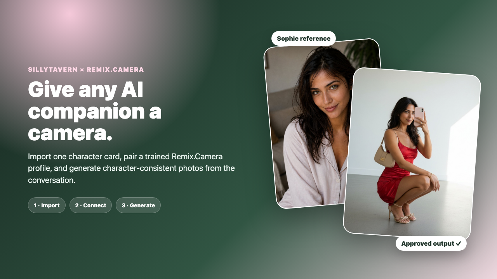

# Sophie: Existing Character to Approved Mirror Selfie

## The use case

Sophie already existed as a chat character. The goal was to add realistic visual replies without rebuilding her conversation model, memory, personality, or lore.

## What the workflow did

1. Imported Sophie's character card into the real local SillyTavern UI.
2. Connected the card to Sophie's trained Remix.Camera visual profile.
3. Ran the local bridge Health Check.
4. Previewed the image prompt without spending credits.
5. Asked for a red-dress mirror selfie in ordinary chat language.
6. Inserted a previously approved Sophie output into the active conversation.

## Result

The walkthrough shows the product's intended first-run story in 22 seconds: import, connect, verify, ask, and receive an in-chat image. The paired profile supplies the visual identity while the existing SillyTavern character continues to supply the conversation.

## Evidence boundary

- Live SillyTavern UI: **yes**
- Live local-bridge Health Check: **yes**
- Live no-credit Preview Prompt: **yes**
- Real Remix.Camera output: **yes**, generation `ApwxCVVjnPumzAf7iXmx`
- New generation submitted during the recording: **no**
- Planned / attempted / generated during the recording: **0 / 0 / 0**

The approved output was created earlier with Sophie's paired profile and then replayed in the real chat for the walkthrough. The checked-in [`result.json`](../sophie-setup-2026-07-21/result.json) records the exact boundary.

## Why this case matters

This is the clearest proof of the additive product promise: a user can keep an existing companion setup and add a visual identity and image actions around it.
